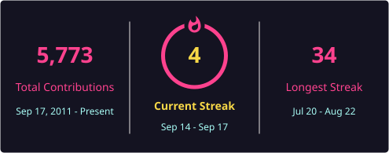

  <h1>AMDphreak</h1>
  

    Systems architect and full-stack developer building an ecosystem of composable tools focused on developer experience (DevX) and high-performance, cross-platform computing.
  

  

    <a href="https://ryanjohnson.dev">Website</a>
    &middot;
    <a href="https://docs.devcentr.org/home/index.html">Dev-Centr docs</a>
    &middot;
    <a href="https://ryanjohnson.dev/inspirations">Inspirations</a>
  

  

    
    
    
    
    
    
    
    
    
    
    
  

## Focus

- Composable tooling, typed systems, and documentation-first developer experience
- High-performance software from long-lived web UIs to cross-platform native code
- Software reliability as a product concern—not an afterthought

Architectural decisions are catalogued in [Dev-Centr docs](https://docs.devcentr.org/home/index.html).

## AI Coding Desk

- **Cursor Auto** — daily driver. It picks well.
- **Grok 4.5** — when I want that model on purpose
- **Cursor cloud agents** — async and background runs when work can leave the editor
- **Hermes** — on the radar to try; no active use case yet
- **T3 Code** — on the radar to try; would run through Cursor CLI if it sticks

---

## Organizations

GitHub orgs I own:

- [antora-supplemental](https://github.com/antora-supplemental)
- [connectome-fs](https://github.com/connectome-fs)
- [dev-centr](https://github.com/dev-centr)
- [dlang-supplemental](https://github.com/dlang-supplemental)
- [FoodTruckNerdz](https://github.com/FoodTruckNerdz)
- [formatte](https://github.com/formatte)
- [HCI-Nerdz](https://github.com/HCI-Nerdz)
- [LinxPhotos](https://github.com/LinxPhotos)
- [nonprofit-resources](https://github.com/nonprofit-resources)
- [openshellorg](https://github.com/openshellorg)

Historical:

- [Cook-Systems-Team-Blue-Feb-2021-Ryan](https://github.com/Cook-Systems-Team-Blue-Feb-2021-Ryan)
- [memphis-cs-projects](https://github.com/memphis-cs-projects)

---

## Curated learning

Stable personal index: **[curated-learning.md](./curated-learning.md)** (videos + classic lists). Dev-Centr holds shared blurbs and may split into topical pages—bookmark the personal file for “my picks,” not only the org index.

- [Developer Roadmap](https://github.com/kamranahmedse/developer-roadmap)
- [System Design Primer](https://github.com/donnemartin/system-design-primer)
- [Build your own X](https://github.com/codecrafters-io/build-your-own-x)
- **Watch:** [Geometric reasoning (Sophontic / Michels)](https://www.youtube.com/watch?v=4S8I22ybG2c) — see [curated-learning.md](./curated-learning.md)

---

## Philosophy

Culture that sharpens taste more than tutorials do. Longer set on [Inspirations](https://ryanjohnson.dev/inspirations).

- [cat-v.org](https://cat-v.org/) — Unix / Plan 9 archive and the [harmful.cat-v.org](https://harmful.cat-v.org/) essays
- [xkcd](https://xkcd.com/) — Randall Munroe; romance, sarcasm, math, and language ([What If?](https://what-if.xkcd.com/))

---

## Language suggestions

These are teaching suggestions, not taste. They cull the ecosystem to a few essential ways of thinking. Long form: [Language recommendations](https://docs.devcentr.org/general-knowledge/explanation/languages/index.html).

Systems programming

- Prefer **D** (or **Rust**) over **C** for new systems work: modules and safer patterns beat C’s global namespace and header friction.
- [C and D](https://docs.devcentr.org/general-knowledge/explanation/languages/c-and-d.html)

Scientific and numerical computing

- Prefer **Julia** over **Python** for serious numerical / ML work when you control the stack.
- [Julia, D, and Java](https://docs.devcentr.org/general-knowledge/explanation/languages/julia-d-and-java.html)

Application and systems scripting

- Prefer **D** over **C++** for application code. [C++ rant (YouTube)](https://youtu.be/7fGB-hjc2Gc?si=6qM7eUBS5t8fV-Np) — same thesis, louder volume.
- For scripting-shaped tools that still talk to the OS, **D** over **Python** when you want readable syntax without a huge runtime.
- [C++ and D](https://docs.devcentr.org/general-knowledge/explanation/languages/cpp-and-d.html) · [D and Rust](https://docs.devcentr.org/general-knowledge/explanation/languages/d-and-rust.html)

Math-heavy / functional style

Programming is math. **Lisp** and **Haskell** are the usual on-ramps if you want lambda-calculus-shaped thinking in performant languages.
- [Haskell by Example](https://lotz84.github.io/haskellbyexample/)

---

## GitHub Snapshot

---

Hey, babe—I fork on the first date.
